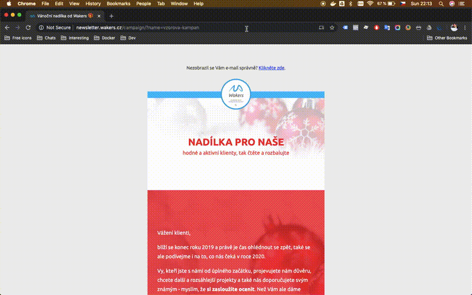
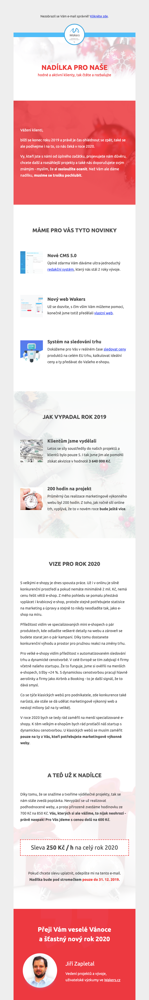

# PHP Mail - newsletter sender
The easiest way how to send e-mail newsletter with **Async PHP** and **tracking open-rate**.

**Update 8/14/20:** You can use our [contactio.app](https://www.contactio.app) **it's free and with unlimited contacts**.

## How to setup your newsletter
1. Install PHP dependencies by [Composer](https://getcomposer.org/) `composer install`.
1. Duplicate `./sender/config.example.php` file, rename it to `config.php` and configure it.
1. Duplicate `./campaign/vzorova-kampan/` folder, rename it and edit files in this folder.
1. Upload `./vendor` and `./campaign/<your-folder>` to your web server.

## How to send tons of emails

### With PHP CLI
1. Install [PHP CLI](http://www.php-cli.com/) >= v.7.1 with [PCNTL](https://www.php.net/manual/en/book.pcntl.php) extension.
1. Run `php ./sender/send.php` to send all e-mail messages.

### With Docker
1. Install [Docker for desktop](https://www.docker.com/products/docker-desktop).
1. Run `./send.sh` to send all e-mail messages.

## How to Open-Rate monitoring
- You can monitor the open-rate stats after running the campaign.
- Just open remote folder `./campaign/*/stats/open-rate.txt`.
- But be careful with GDPR (mail addresses are visible in your public folder).

## How e-mail message can looks like

